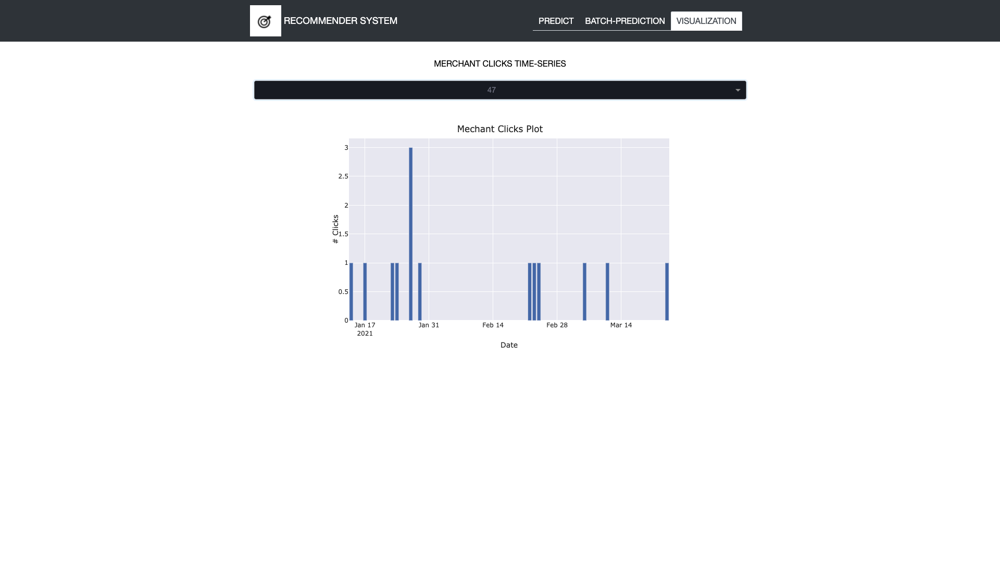

## Recommender System

#### Objective 
To build a recommender system to recommend next best merchant to users.

#### How to run
1. Build docker image
```
docker build -t sys-rec .
```

2. Run the docker container
```
docker run -p 8050:8050 sys-rec
```
3. Use the app here
```
http://0.0.0.0:8050/
```

#### Method
A word2vec model is trained to obtain embeddings for all merchants. To this end, merchants clicked by a specific user within close time proximity are deemed as similar. Such merchants are extracted from the clicks data and used in model training. During prediction, the last 5 merchants clicked by the user is leveraged and merchants similar to them are recommended. In the case, the use does not have sufficient history of clicks, the most popular merchants will be recommended. 


To evaluated model performance, the clicks data is split based on time: clicks during Jan, Feb 2021 constitute the training data, where as March 2021 represent the test data. Mean Average Precision @top 5 recommendation is used as evaluation metric. The model scores ~0.05 mAP in the test set.

After testing, all clicks data are used to build the final model, to be used in the app.

### App
The app provides three pages:



